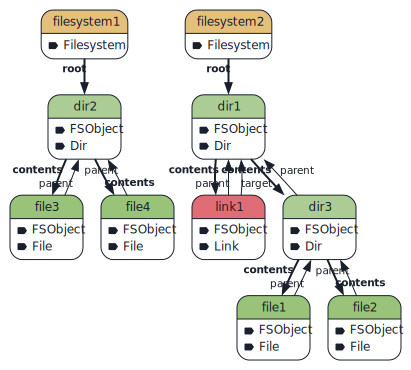
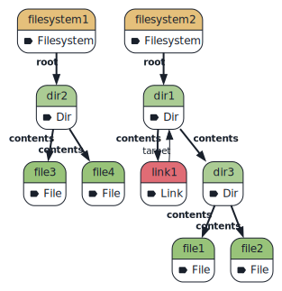
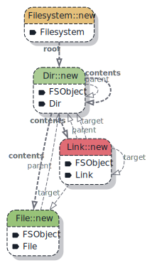

# File system tutorial

This tutorial gives a brief overview of the partial modeling and model generation features of the Refinery framework.
It follows the development and analysis of a simple Refinery problem specification for modeling file systems.
We adapted the case study from [Chapter&nbsp;1](https://alloytools.org/tutorials/online/frame-FS-1.html) of the [Alloy tutorial][alloy].

[alloy]: https://alloytools.org/tutorials/online/index.html

## Describing domain concepts

The Refinery partial modeling language supports [metamodeling](../../language/classes/index.md) to describe desired structure of generated models.
We may use [classes](../../language/classes/index.md#classes) and [references](../../language/classes/index.md#references) to describe domain concepts similarly to [object-oriented programming languages](https://en.wikipedia.org/wiki/Object-oriented_programming), such as C++ and Java.

```refinery checkpoint=metamodel try
class Filesystem {
    contains Dir[1] root
}

abstract class FSObject {
    container Dir parent opposite contents
}

class Dir extends FSObject {
    contains FSObject[] contents opposite parent
}

class File extends FSObject.

class Link extends FSObject {
    FSObject[1] target
}
```

Throughout this website, the _Try in Refinery_ button will always denote an interactive example.
If you click it now, it'll take you to the [Refinery web UI](#refinery-web-ui).

### Metamodel constraints

Our specification not only lists the concepts (classes and relations) of [file system](#describing-domain-concepts) the domain, but also prescribes a set of **metamodel constraints** concisely.

:::info

Metamodel constraints are often left implicit in programming. For example, the Java runtime environment will always prevent us from instantiating an `abstract` class.
However, in _logical_ languages like [Alloy][alloy], we have to [specify most of these constraints](https://alloytools.org/tutorials/online/frame-FS-1.html) manually.

While Refinery has a rigorous [logical background](../../language/logic/index.md), you'll see that it still lets us define domains in high-level terms.

:::

Some constraints are about possible instances of classes:

* The classes `Dir`, `File`, and `Link` are marked as [**subclasses**](../../language/classes/index.md#inheritance) of `FSObject` with the `extends` keyword. Instances of the classes must also be instances of `FSObject`.
* Conversely, the class `FSObject` is marked as an **abstract class** with the `abstract` keyword. This means that any instance of `FSObject` must also be an instance of one of its subclasses.
* Classes that do not have a common superclass[^multiple-inheritance] are **disjoint,** i.e., they can't have any instances in common.

[^multiple-inheritance]: The Refinery language supports _multiple inheritance,_ where a class may extend multiple superclasses. However, in this tutorial, we'll rely on single inheritance only.

Other constraints are about references:

* References between classes must adhere to **[type constraints](../../language/classes/index.md#references).** For example, the source of a `parent` relationship must be an `FSObject` instance and its target must be a `Dir` instance.
* There is an [**opposite constraint**](../../language/classes/index.md#opposite-constraints) between `parent` and `contents`. Every occurrence of a `parent` relationship must have a `contents` relationship in the other direction and vice versa.
* All references must obey the corresponding **[multiplicity constrains](../../language/classes/index.md#multiplicity):**
    * The notation `[]` means that multiple outgoing references are allowed, i.e., a `Dir` instance may have 0 or more `contents`. If we wanted to forbid empty `Dir`s, we could do so by writing `[1..*]` instead.
    * The notation `[1]` means that there is _exactly_ one `root` for a `Filesystem` or `target` for a `Link`.
    * If there is no specified multiplicity, such as in the case of `parent`, 0 or 1 outgoing references are assumed. This closely matches most object-oriented programming languages, where a reference by default may be `null`.
* The references `root` and `contents` are marked with the keyword `contains` as **containment references** that form a **[containment hierarchy](../../language/classes/index.md#containment-hierarchy):**
    * Instances of classes that appear as the _reference type_ of a containment reference, such as the instances of `FSObject` (and its subclasses), _must_ have an incoming containment relationship.
    * Conversely, the instances of `Filesystem` are the **roots** of the containment hierarchy.

Notice that we could use metamodel constraints to describe most of how our domain works. For example, we don't have to further elaborate that a single file system has a single root directory and forms a tree, or that a link points to exactly one target.

You can read more about else what you can express with metamodel constraints by clicking on the links in the lists above. They'll take you to the relevant parts of the [Refinery language reference](../../language/).

## Model generation

Model generation automatically constructs possible instance models of your problem specification.
You can use it to get _examples_ for reasoning about a domain, _candidate designs_ for an engineering problem, or _test cases_ for data-driven software.

Before we can start generating models, we'll need to specify the desired model size[^model-size]. In this example, we'll generate an instance which has between 10 and 20 nodes (objects) by using the following [`scope`](../../language/logic/index.md#type-scopes) declaration:

[^model-size]: If you don't specify the model size at all, Refinery will often return an _empty_ model if it can satisfy the domain constraints that way. On the other hand, you shouldn't be very strict with the desired model size (e.g., generate _exactly_ 10 nodes) either, because some constraints may be unsatisfiable for specific model sizes.

```refinery continue try
scope node = 10..20.
```

You should click the button labeled _Try in Refinery_ above to open this problem specification in Refinery.

### Refinery web UI

Since you've just opened the user interface of Refinery, this is a great time to familiarize yourself with it!
We annotated the following screenshot to show your the various parts of the interface.


import CloudIcon from '@material-icons/svg/svg/cloud/baseline.svg';
import CloudOffIcon from '@material-icons/svg/svg/cloud_off/baseline.svg';
import CodeIcon from '@material-icons/svg/svg/code/baseline.svg';
import LockIcon from '@material-icons/svg/svg/lock/baseline.svg';
import LockOpenIcon from '@material-icons/svg/svg/lock_open/baseline.svg';
import PlayArrowIcon from '@material-icons/svg/svg/play_arrow/baseline.svg';
import SaveAltIcon from '@material-icons/svg/svg/save_alt/baseline.svg';
import SchemaIcon from '@material-icons/svg/svg/schema/round.svg';
import SyncProblemIcon from '@material-icons/svg/svg/sync_problem/baseline.svg';
import TableChartIcon from '@material-icons/svg/svg/table_chart/baseline.svg';
import TuneIcon from '@material-icons/svg/svg/tune/baseline.svg';

1. The **code editor** appears on the left side of the window by default. It lets you edit your problem specification, and provides common helper functions like auto-complete (content assist), syntax highlighting, syntax checking, and semantic validation.

2. The **toolbar** is located above the code editor, which includes buttons for common editing operations and settings.

    Moreover, you can find the <CloudIcon className="inline-icon" aria-hidden="true" /> **connection** button here. If the button shows a <CloudOffIcon className="inline-icon" aria-hidden="true" /> **disconnected** state or an <SyncProblemIcon className="inline-icon" aria-hidden="true" /> **error,** you should check your internet connection. Clicking the button will attempt to reconnect. Clicking the button _again_ will disconnect from the server, but some code editing services and the model generator require an active connection[^refinery-server].

3. The **graph view** shows a visualization of your problem specification. The visualization of generated models will also appear here. We'll discuss the notation used in the visualization [later in this tutorial](#partial-models).

    This view is continuously updated according to the contents of the code editor. If the update fails (e.g., due to syntax errors in your model or disconnecting from Refinery), the colors of the visualization are dimmed until the next successful update.

4. The <TuneIcon className="inline-icon" aria-hidden="true" /> **filter panel** lets you customize what should appear in the visualization. Click the button to open the panel.

5. The <SaveAltIcon className="inline-icon" aria-hidden="true" /> **export panel** lets you save the diagram as an SVG, PDF, or PNG file. Click the button to open the panel.

6. **Zoom controls** lat you adjust the size of the visualization and make it automatically fit the screen.

7. The **view selector** lets you toggle the <CodeIcon className="inline-icon" aria-hidden="true" /> **code,** <SchemaIcon className="inline-icon" aria-hidden="true" /> **graph,** and <TableChartIcon className="inline-icon" aria-hidden="true" /> **table views.** You can have all three views open at the same time, or even just a single one to take a deeper look at the model.

9. The **concretization button** lets you switch between <LockOpenIcon className="inline-icon" aria-hidden="true" /> **partial** and <LockIcon className="inline-icon" aria-hidden="true" /> **concrete** views of your model. Model generation always starts from the partial model, but switching concretization off can help you inspecting your model with closed-world semantics.

8. Finally, the <PlayArrowIcon className="inline-icon" aria-hidden="true" /> **generate** button initiates model generation. You may only press this button of you problem specification is valid. Otherwise, it'll jump to the validation errors in your specification in the code view. Pressing the button while model generation is running will cancel the generation.

[^refinery-server]: This doesn't mean that you always need an internet connection to use Refinery! You can also download and run our [Docker container](../../docker/index.md) to host a Refinery server on your own machine for yourself or for your organization.

### Running the generator

You can initiate model generation by clicking the <PlayArrowIcon className="inline-icon" aria-hidden="true" /> **generate** button.
It should return an instance model like this:



Take a moment to verify that this model indeed satisfies the [metamodel constraints](#metamodel-constraints) and contains between 10 and 20 nodes as we [previously requested](#model-generation).

You can use the <TuneIcon className="inline-icon" aria-hidden="true" /> **filter panel** to simplify this visualization.
It is readily apparent from the [metamodel constraints](#metamodel-constraints) that all non-`Filesystem` nodes are `FSObject` instances, and the `parent` relationships always appear in `opposite` to the `contents` relationships. Thus, we can hide `FSObject` and `parent` from the visualization entirely without losing any information with the following filter settings:


We end up with the following visualization:



Clicking the <PlayArrowIcon className="inline-icon" aria-hidden="true" /> **generate** button will yield different models by selecting a different _random seed_ to control the model generator.
This means that if you want to see multiple different instance models for your problem specification, you can just run the generation multiple times.

import CloseIcon from '@material-icons/svg/svg/close/baseline.svg';

Generated models will appear as _tabs_ in the Refinery web UI.
You should also take the moment to explore the tabular representations of the generated model in the <TableChartIcon className="inline-icon" aria-hidden="true" /> **table view.**
You can remove generated models that you no longer need by clicking the <CloseIcon className="inline-icon" aria-hidden="true" /> **close** button.

At the end of this exercise, you should be looking at something like this in Refinery:


## Partial models

:::warning

This section of the tutorial is under construction.

:::


